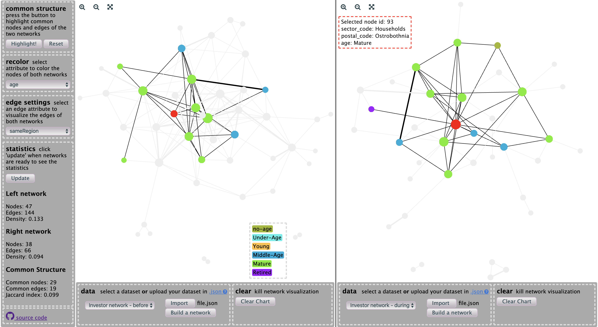

# Sigma Networks

## How to use 

The application is designed to work with **two** networks that are expected to have **common structure**. For example, these could be a friendship network observed in two periods of time.

You can try and see how it works with the datasets we have in the selection: *Investor network - before [crisis]* and *Investor network - after [crisis]*.

1. Select a dataset on the left and right side or upload your datasets in .json format. To use your dataset:
   - See the [.json template](https://github.com/schatt89/sigmaNetworks/blob/master/public/data/template.json) 
   - See the [`.ipynb` notebook](https://github.com/schatt89/sigmaNetworks/blob/master/transform_data/convert_graphml_to_json.ipynb) to learn how to convert your data to the desired .json format
   - Import file and then click `Build a network` button
2. Select a node attribute to color the nodes and place the legend by dragging it
3. Select an edge attribute to add weight to the edges
4. Update statistics if you need them
5. Highlight the common links and nodes to see the underlying structure of the networks 

Some features:
- Hover over a node to see its attributes
- Double click on a node will display its attributes in an infobox and highlight its first-order neighbors in both networks
- Click on an infobox to close it
- `Reset` button will cancel any highlight
- `Clear Chart` button will remove the network
- You can change the size of the left and right side by dragging the separating bar
- Use navigation icons to zoom in and out 